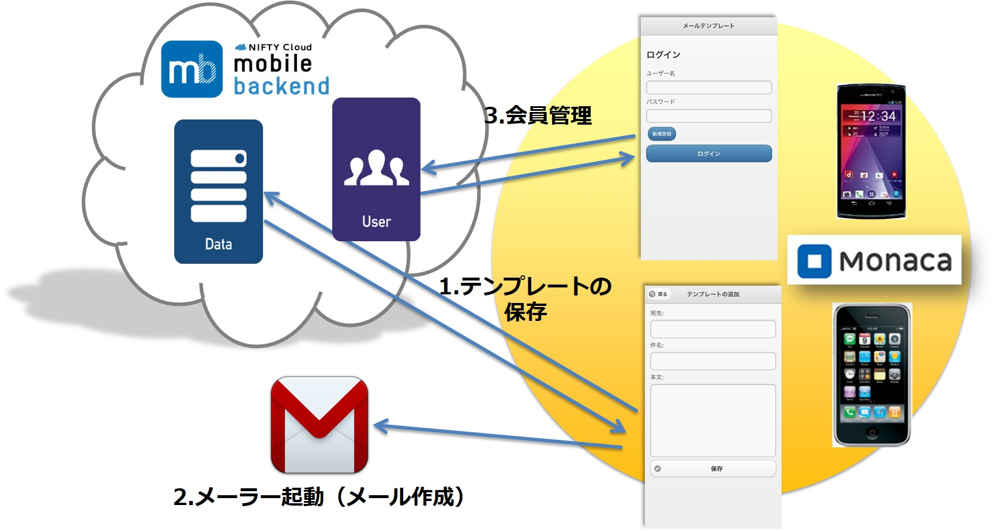

# 【開発超初心者向け】Monaca x mBaaSでメールテンプレートアプリを作ろう！

##*はじめに*

###■このアプリはアプリ開発超初心者がネットで公開されているアプリのソースや情報を組み合わせてほぼコピー＆ペーストだけで作りました。しかも開発期間わずか３日で形にできました！開発超初心者でもこのアプリ作成を通してJavaScriptを勉強していけば、すぐに理解できる内容になっています。このアプリを作り終わった後、必ず『アプリ作成って超簡単！』と思えるとはずです^^*

##*ご案内*

###■このアプリは[ニフティクラウドmobile backend](http://mb.cloud.nifty.com/?utm_source=community&utm_medium=referral&utm_campaign=sample_monaca_login_template)で開催しているハンズオンセミナーの教材として作成しました。資料に沿って進めていただければ、アプリ作成が可能となっておりますが、細かいコードの説明は書かれていませんので、ぜひ[セミナー（無料）](https://ncmb.doorkeeper.jp/)にご参加ください。
##*概要*

###■[Monaca](https://ja.monaca.io/)を用いてアプリを作成します

 * [Monaca](https://ja.monaca.io/)は、HTML/CSS/JavaScriptでマルチプラットフォーム（iOS/Android/Windowsなど）にアプリを開発できる統合開発環境です。無料から使えます。

 

###■[ニフティクラウドmobile backend](http://mb.cloud.nifty.com/?utm_source=community&utm_medium=referral&utm_campaign=sample_monaca_login_template)のDB、会員管理の機能を使います

 * [ニフティクラウドmobile backend](http://mb.cloud.nifty.com/?utm_source=community&utm_medium=referral&utm_campaign=sample_monaca_login_template)（通称：*mBaaS*）は、スマホアプリのサーバ側機能（プッシュ通知、会員管理、DBなど）をサーバ開発不要で実装できるツールです。無料から使えます。
 * ネット上で公開されている[ドキュメント](http://mb.cloud.nifty.com/doc/current/#/JavaScript)をコピー＆ペーストするだけで簡単に機能が使えます。

###■ネットで見つけたサンプルを使いました

* Monacaでプロジェクトを新規作成するとき、サンプルプロジェクトを使用することがきます。その中に[バックエンド メモ帳アプリ](http://docs.monaca.mobi/cur/ja/sampleapp/samples/backend_memo/)があります。これをベースとして、メールのテンプレートをmBaaSに保存できるようにアレンジしました。
* メーラー起動に関しては「Monaca　メーラー」で検索してヒットした[このページ](http://plaza.rakuten.co.jp/kuni2007/diary/201111230000/)を参考にしました。これだけだとAndroidでは上手くいかなかったので、Cordvaプラグインを使う方法を[このページ](http://ja.stackoverflow.com/questions/10166/webintent-%E3%83%97%E3%83%A9%E3%82%B0%E3%82%A4%E3%83%B3%E3%81%A7%E3%83%A1%E3%83%BC%E3%83%AB%E3%82%92%E7%94%9F%E6%88%90%E3%81%99%E3%82%8B%E3%81%A8%E4%B8%80%E9%83%A8%E3%83%A1%E3%83%BC%E3%83%AB%E3%82%A2%E3%83%97%E3%83%AA%E3%81%A7%E6%96%87%E5%AD%97%E5%8C%96%E3%81%91%E3%81%97%E3%81%A6%E3%81%97%E3%81%BE%E3%81%86)で見つけました。
* 会員管理に関しては[サンプル](http://qiita.com/thuydg@github/items/75a8a213ba4f617b4ef0)があったので、これをそのまま利用しました。

という具合に、ありものでアプリができてしまいました！

##*作成方法*

* 事前準備

 * [ニフティクラウドmobile backend](http://mb.cloud.nifty.com/?utm_source=community&utm_medium=referral&utm_campaign=sample_monaca_login_template)の利用登録
 * [Monaca](https://ja.monaca.io/) の利用登録とMonacaデバッガーのインストール
　
* Monacaにコーディングする前の準備
 
 * [ニフティクラウドmobile backend](http://mb.cloud.nifty.com/?utm_source=community&utm_medium=referral&utm_campaign=sample_monaca_login_template)で新しいアプリを作成、APIキーの確認

 * 本ページよりサンプルプロジェクト（ZIPファイル）のURLを取得して、 [Monaca](https://ja.monaca.io/)にインポート、プロジェクトを新規作成する。

* 構成

 * (1)～(16)の全16ヶ所にコードをコピペするとアプリが完成する仕組みになっています。
 
 * 下記の三部に分けて構成してあり、それぞれで動作確認ができるようになっています。

 * 【第一部(1)～(7)：オンラインにデータを保存しよう！】→動作確認１
      
 * 【第二部(8)～(9)：保存したメールを送信しよう！】→動作確認２
      
 * 【第三部(10)～(16)：ログイン機能をつけよう！】→動作確認３（完成）

* 細かい操作や詳細を確認されたい場合はセミナーページをご確認ください。（※スライドを用意予定）

##*作成手順*

###　【第一部(1)～(7)：オンラインにデータを保存しよう！】
(1)　【`index.html` の編集】 JavaScriptSDKをjsファイルにインポートして、下記のコードを追加する。

    

------------------------------------------------------------------------------------
(2)　【`js/template.js` の編集】 mBaaSのAPIキーの設定をする。

    var APPLICATION_KEY = "YOUR_NCMB_APPLICATION_KEY";
    var CLIENT_KEY ="YOUR_NCMB_CLIENT_KEY";

※`YOUR_NCMB_APPLICATION_KEY`と`YOUR_NCMB_CLIENT_KEY` にダッシュボードからコピーしたAPIキーをそれぞれ貼り付ける。

------------------------------------------------------------------------------------
(3)　【`js/template.js` の編集】 mBaaSの初期化

    var ncmb = new NCMB(this.APPLICATION_KEY, this.CLIENT_KEY);

------------------------------------------------------------------------------------
(4)　【`js/template.js` の編集】 保存用クラスの生成

    var EmailTemplate = this.ncmb.DataStore("emailTemplate");

------------------------------------------------------------------------------------
(5)　【`js/template.js` の編集】 メールテンプレートを作成して保存する

        var emailTemplate = new this.EmailTemplate();
        emailTemplate.set("to", to)
                     .set("title", title)
                     .set("message", message)
                     //.set("acl", acl)
                     .save()
                     .then(function(emailTemplate){
                         // 保存後の処理
                         // アラート
                         navigator.notification.alert(
                             "テンプレートを保存しました", // メッセージ
                             alertDismissed, // コールバック関数
                             '保存', // タイトル
                             'OK' // ボタン名
                         );
                     })
                     .catch(function(err){
                         // エラー処理
                         // アラート
                         navigator.notification.alert(
                             "テンプレートを保存できませんでした。\nもう一度入力してください", // メッセージ
                             alertDismissed, // コールバック関数
                             '保存失敗', // タイトル
                             'OK' // ボタン名
                         );
                     });

------------------------------------------------------------------------------------
(6)　【`js/template.js` の編集】 メールテンプレートを削除する

        var objectId = id; 
        EmailTemplate.equalTo("objectId", objectId) // id指定
                     .fetch()
                     .then(function(data){
                         data.delete()
                             .then(function(result){
                                 // 削除後の処理
                                 // アラート
                                     navigator.notification.alert(
                                         'テンプレートを削除しました', // メッセージ
                                             alertDismissed, // コールバック関数
                                             '削除', // タイトル
                                             'OK' // ボタン名
                                     );
                             })
                             .catch(function(err){
                                 // エラー処理
                                 // アラート
                                 navigator.notification.alert(
                                     '削除できませんでした' , // メッセージ
                                     alertDismissed, // コールバック関数
                                     '削除失敗', // タイトル
                                     'OK' // ボタン名
                                 );
                             });
                     })
                     .catch(function(err){
                         // エラー処理
                         // アラート
                         navigator.notification.alert(
                             '削除できませんでした', // メッセージ
                             alertDismissed, // コールバック関数
                             '削除失敗', // タイトル
                             'OK' // ボタン名
                         );
                     });

------------------------------------------------------------------------------------
(7)　【`js/template.js` の編集】 トップページの情報更新をする（保存されたテンプレートの全件検索）

        EmailTemplate.fetchAll()
                     .then(function(results){
                         // 検索後の処理
                             setListData(results);
                     })
                     .catch(function(err){
                         // エラー処理
                         $li = $("<li>--登録されているテンプレートはありません--</li>");
                         $("#TopListView").prepend($li);
                     });

------------------------------------------------------------------------------------
#### 動作確認１

* 「Cordvaとプラグインの管理」を開く
 * 「Notification」を有効にする
 * 「StatusBar」を有効にする ※iOSのみ

→ Monacaデバッガーを使って動作確認１をしてみましょう

→ mBaaSのダッシュボード（データストア）を確認してみましょう

------------------------------------------------------------------------------------
### 　【第二部(8)～(9)：保存したメールを送信しよう！】

(8)　【`index.html` の編集】 Eメール作成ボタンを作る

    <a data-icon="star" class="ui-btn-right" onclick="onStartMailer()">Ｅメール作成</a>

------------------------------------------------------------------------------------
(9)　【`js/template.js` の編集】 メーラーを起動する

* iOSの場合

            var mailto = "mailto:"+ to +"?subject="+ title +"&body="+ message;
            location.href= mailto;

* Androidの場合

 * 「Cordvaとプラグインの管理」を開く→ 「webIntent」を有効にする

                var mailto = "mailto:"+ to +"?subject="+ title +"&body="+ message;
                // 改行コード変換
                mailto = mailto.replace(/ /g, '%0D%0A'); //  →%0D%0Aに書き換える
        
                window.plugins.webintent.startActivity (
                            {
                                action: window.plugins.webintent.ACTION_VIEW,
                                url: mailto
                            },
                            function () {
                                // 成功時の処理
                            },
                            function () {
                                // 失敗時の処理
                            }
                 );

------------------------------------------------------------------------------------
#### 動作確認２

→ Monacaデバッガーを使って動作確認２をしてみましょう
※ 確認したら、作成したメールテンプレートデータをすべて削除しておきましょう

------------------------------------------------------------------------------------
### 　【第三部(10)～(16)：ログイン機能をつけよう！】

(10)　【`index.html` の編集】 ログインページの作成

        

            <header data-role="header" data-position="fixed" data-theme="c">
                <h1>メールテンプレート</h1>
            </header>
            <section data-role="content">
                <h1>ログイン</h1>
                ユーザー名
                <input type="text" id="login_username">
                パスワード
                <input type="password" id="login_password">
            <a href="#RegisterPage" data-role="button" data-mini="true" data-inline="true" data-theme="b">新規登録</a>
            <a href="#" id="LoginBtn" data-role="button" data-inline="false" data-theme="b">ログイン</a>
            </section>
        

------------------------------------------------------------------------------------
(11)　【`index.html` の編集】 新規登録ページの作成

        

            <header data-role="header" data-position="fixed" data-theme="c">
                <h1>メールテンプレート</h1>
            </header>
            <section data-role="content">
                <h1>新規登録</h1>
                    ユーザー名
                <input type="text" id="reg_username">
                    パスワード
                <input type="password" id="reg_password">
                <a href="#" id="RegisterBtn" data-role="button" data-inline="false" data-theme="b">新規登録してログイン</a>
                <a href="#LoginPage" data-role="button" data-mini="true" data-inline="true" data-theme="b">ログイン画面に戻る</a>
            </section>
        

------------------------------------------------------------------------------------
(12)　【`index.html` の編集】 ログアウトボタンの作成

    <a data-icon="delete" class="ui-btn-right" onclick="onLogoutBtn()">ログアウト</a>

------------------------------------------------------------------------------------
(13)　【`js/template.js` の編集】 新規登録（とログイン）機能の追加

        //ユーザー登録
        var user = new ncmb.User();
        user.set("userName", username)
            .set("password", password);
    
        // 任意フィールドに値を追加 
        user.signUpByAccount()
            .then(function(user) {
                // 新規登録後の処理
                // アラート
                navigator.notification.alert(
                    '登録完了!!\nログインしました', // メッセージ
                    alertDismissed, // コールバック関数
                    '新規登録', // タイトル
                    'OK' // ボタン名
                );
                this.currentLoginUser = ncmb.User.getCurrentUser(); // カレントユーザーの取得
                $.mobile.changePage('#TopPage');
                initTopPage();
            })
            .catch(function(error) {
                // エラー処理
                // アラート
                navigator.notification.alert(
                    '登録に失敗しました\nもう一度やりなおしてください', // メッセージ
                    alertDismissed, // コールバック関数
                    '新規登録', // タイトル
                    'OK' // ボタン名
                );
            });

------------------------------------------------------------------------------------
(14)　【`js/template.js` の編集】 ログイン機能の追加

        // ユーザー名とパスワードでログイン
        ncmb.User.login(username, password)
                 .then(function(user) {
                     // ログイン後の処理
                     // アラート
                     navigator.notification.alert(
                        'ログインしました', // メッセージ
                        alertDismissed, // コールバック関数
                        'ログイン', // タイトル
                        'OK' // ボタン名
                     );
                     currentLoginUser = ncmb.User.getCurrentUser(); // カレントユーザーの取得
                     $.mobile.changePage('#TopPage');
                     initTopPage();
                 })
                 .catch(function(error) {
                     // エラー処理
                     // アラート
                     navigator.notification.alert(
                         "ログインできませんでした。\nもう一度入力してください", // メッセージ
                         alertDismissed, // コールバック関数
                         'ログイン失敗', // タイトル
                         'OK' // ボタン名
                     );
                 });

------------------------------------------------------------------------------------
(15)　【`js/template.js` の編集】 ログアウト機能の追加

        //ログアウト
        ncmb.User.logout();
        // アラート
        navigator.notification.alert(
            'ログアウトしました', // メッセージ
            alertDismissed, // コールバック関数
            'ログアウト', // タイトル
            'OK' // ボタン名
        );
        currentLoginUser = null; // カレントユーザーをnullにする

------------------------------------------------------------------------------------
(16)　【`js/template.js` の編集】 acl（アクセス権限）設定の追加

        var acl = new ncmb.Acl();
        acl.setUserReadAccess(currentLoginUser, true)
           .setUserWriteAccess(currentLoginUser, true);

* (5)の`//.set("acl", acl)`の`//`（コメント化）を取る

------------------------------------------------------------------------------------
#### 動作確認３（完成）

→ Monacaデバッガーを使って動作確認３（完成）をしてみましょう
→ mBaaSのダッシュボード（会員管理、データストア（acl設定））を確認してみましょう

------------------------------------------------------------------------------------